# ChaosKit Architecture

## Overview

ChaosKit is a modular framework for chaos engineering that follows clean architecture principles. The framework enables systematic testing of system reliability through controlled fault injection and invariant validation.

## Core Principles

- **Separation of Concerns**: Clear boundaries between components
- **Interface-Based Design**: Extensibility through well-defined interfaces
- **Context Propagation**: Chaos capabilities flow through context
- **Thread Safety**: All components are designed for concurrent execution
- **Structured Logging**: Comprehensive observability with slog

## High-Level Architecture

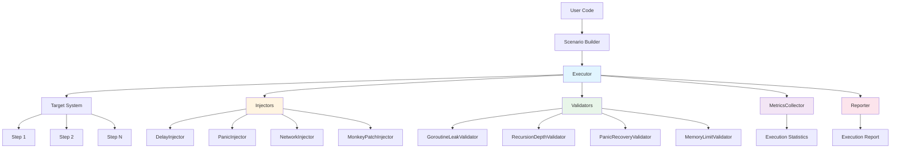

## Component Interaction

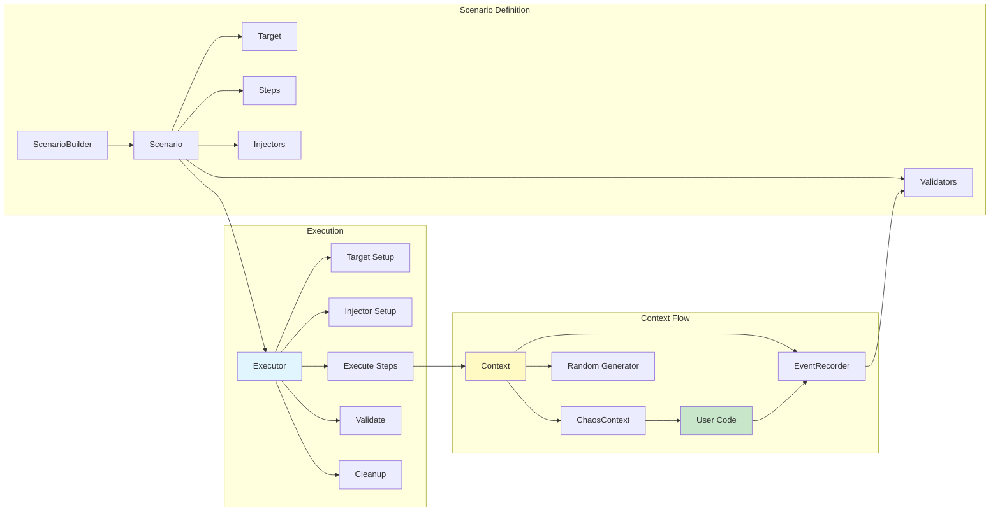

## Execution Flow

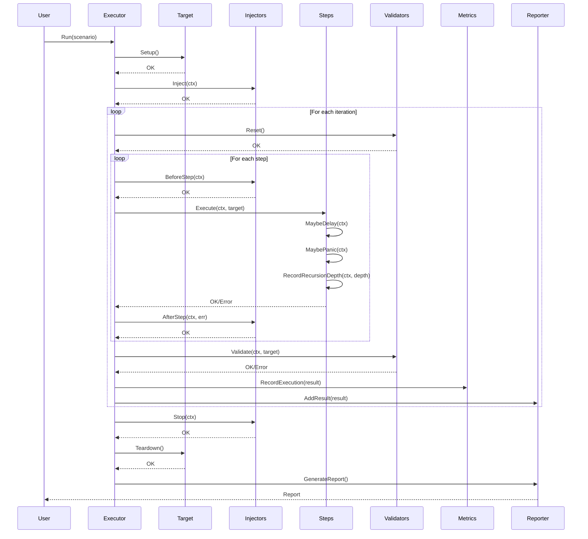

## Injector Lifecycle

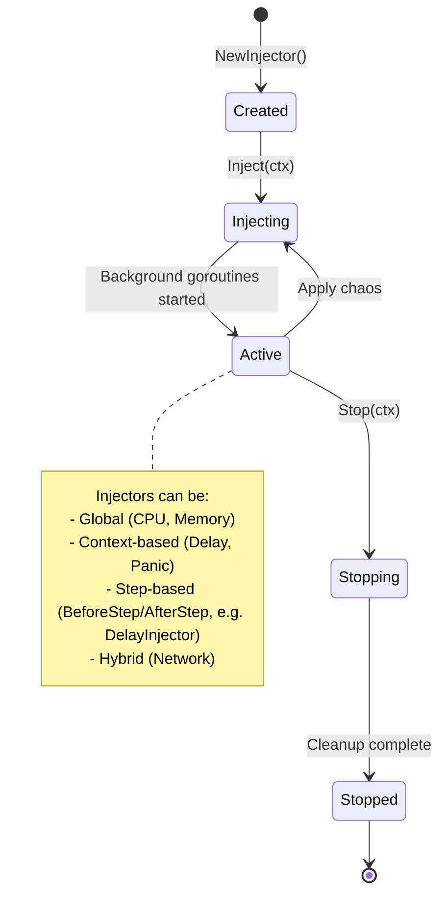

## Context-Based Chaos Flow

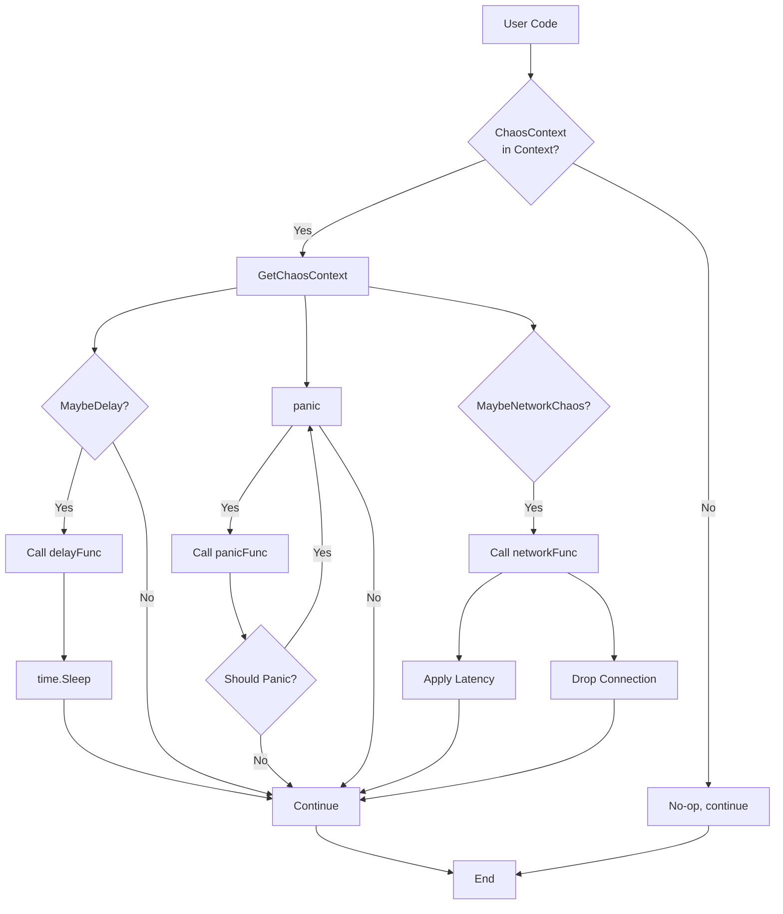

## Validator Execution Flow

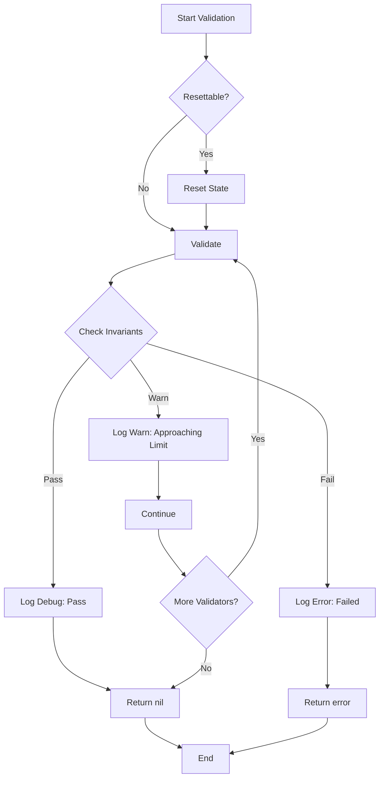

## Injector Types

```mermaid
graph TB
    Injector[Injector Interface] --> Global[GlobalInjector]
    Injector --> Context[ContextInjector]
    Injector --> Step[StepInjector]
    Injector --> Hybrid[HybridInjector]
    
    Global --> CPU[CPUInjector]
    Global --> Memory[MemoryInjector]
    Global --> NetworkProxy[Network Proxy Injectors]
    
    Context --> Delay[DelayInjector]
    Context --> Panic[PanicInjector]
    Context --> Cancellation[ContextCancellationInjector]
    
    Step --> StepDelay[DelayInjector<br/>BeforeStep/AfterStep]
    Step --> ContextPanic[PanicInjector<br/>via MaybePanic()]
    
    Hybrid --> NetworkContextual[ContextualNetworkInjector]
    
    Injector --> Provider[ChaosProvider]
    Provider --> DelayProvider[ChaosDelayProvider]
    Provider --> PanicProvider[ChaosPanicProvider]
    Provider --> NetworkProvider[ChaosNetworkProvider]
    
    style Injector fill:#e1f5ff
    style Global fill:#fff4e1
    style Context fill:#e8f5e9
    style Step fill:#f3e5f5
    style Hybrid fill:#fce4ec
```

## Validator Types

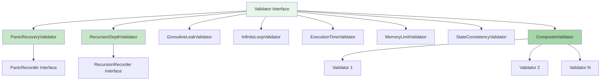

## Extension Points

### Creating Custom Injectors

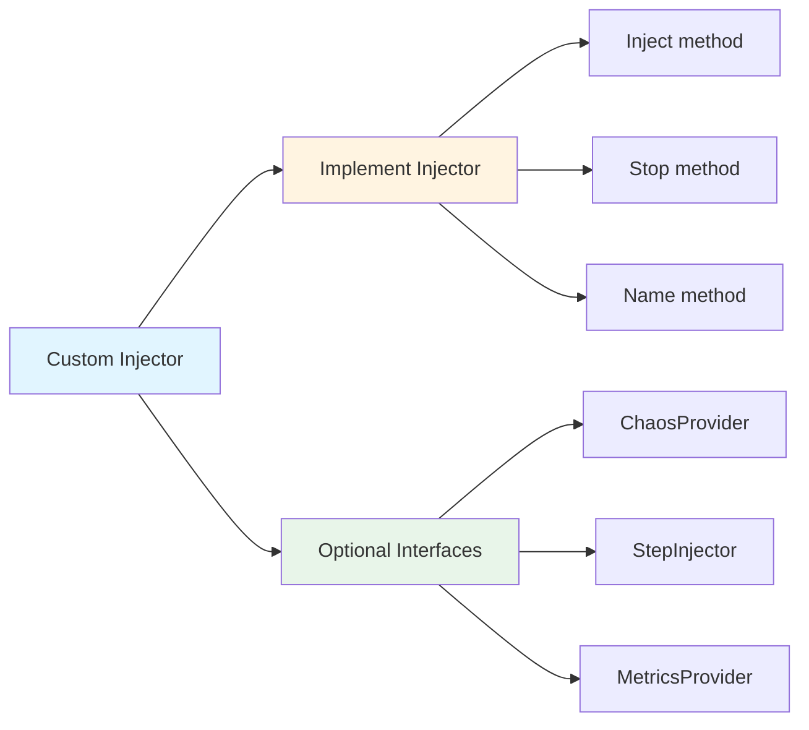

### Creating Custom Validators

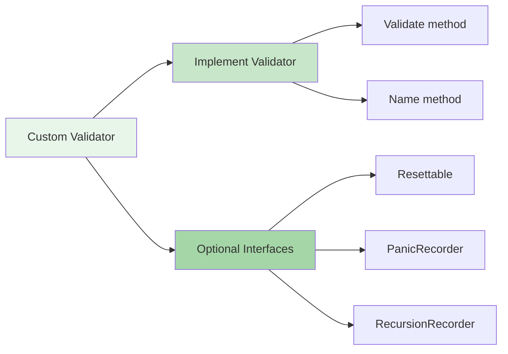

## Data Flow

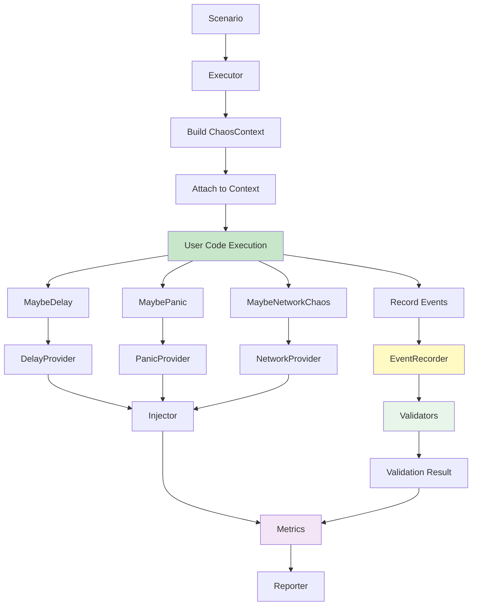

## Thread Safety Model

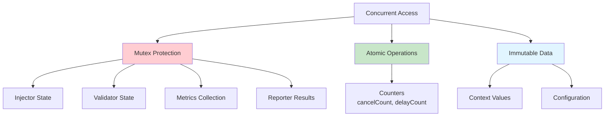

## Design Decisions

### 1. Context-Based Chaos Injection

**Decision**: Use context to propagate chaos capabilities to user code.

**Rationale**:
- Non-intrusive: No need to pass injectors explicitly
- Thread-safe: Context is immutable and goroutine-safe
- Flexible: Can be attached/detached dynamically
- Standard: Follows Go idioms

**Trade-offs**:
- Requires code instrumentation (calling MaybeDelay, etc.)
- Context overhead (minimal)

### 2. Structured Logging with slog

**Decision**: Use Go's standard `log/slog` package for all logging.

**Rationale**:
- Standard library: No external dependencies
- Structured: Easy to parse and filter
- Performance: Optimized for production use
- Levels: Built-in support for Debug/Info/Warn/Error

**Trade-offs**:
- Requires Go 1.25+ (acceptable for modern projects)

### 3. Interface-Based Design

**Decision**: Use interfaces extensively for extensibility.

**Rationale**:
- Testability: Easy to mock and test
- Flexibility: Multiple implementations
- Extensibility: Users can create custom components
- Clean: Clear contracts between components

**Trade-offs**:
- More interfaces to maintain
- Potential over-engineering (mitigated by keeping interfaces focused)

### 4. Builder Pattern for Scenarios

**Decision**: Use fluent builder pattern for scenario construction.

**Rationale**:
- Readability: Clear, chainable API
- Type safety: Compile-time validation
- Flexibility: Optional parameters without function overloading
- Discoverability: IDE autocomplete guides usage

**Trade-offs**:
- More code to maintain
- Slightly more complex than struct initialization

### 5. Separation of Injectors and Validators

**Decision**: Keep injectors and validators as separate components.

**Rationale**:
- Single Responsibility: Each component has one job
- Composability: Mix and match independently
- Testability: Test injection and validation separately
- Clarity: Clear separation of concerns

**Trade-offs**:
- More components to manage
- Potential duplication (mitigated by shared interfaces)

## Performance Considerations

1. **Lock Granularity**: Fine-grained locks to minimize contention
2. **Atomic Operations**: Used for counters to avoid mutex overhead
3. **Context Immutability**: Context values are immutable, safe for concurrent access
4. **Copy-on-Read**: Maps and slices are copied when needed for thread safety
5. **Lazy Initialization**: Validators initialize baselines on first use

## Security Considerations

1. **Monkey Patching**: Only for testing, requires explicit build flags
2. **Network Proxies**: Requires explicit setup, not enabled by default
3. **Context Isolation**: Each scenario has isolated context
4. **Resource Limits**: Validators enforce resource limits

---

**Last Updated**: November 2025  
**Version**: 1.0

