# ChaosKit Architecture

## Overview

ChaosKit is a modular framework for chaos engineering that follows clean architecture principles. The framework enables systematic testing of system reliability through controlled fault injection, invariant validation, verdict calculation, and observability export.

### Architecture Layers

- **Experiment Authoring**: Scenario DSL, scoped injectors, and testing helpers.
- **Execution Core**: Executor, chaos context, injectors, validators, and step wrappers.
- **Observability & Verdicts**: Metrics collector, reporters, verdict engine, and exporters.
- **Integration Surface**: `chaoskit/testing`, CLI utilities, and Prometheus/HTTP exporters.

## Core Principles

- **Separation of Concerns**: Clear boundaries between components
- **Interface-Based Design**: Extensibility through well-defined interfaces
- **Context Propagation**: Chaos capabilities flow through context
- **Thread Safety**: All components are designed for concurrent execution
- **Structured Logging**: Comprehensive observability with slog

## High-Level Architecture

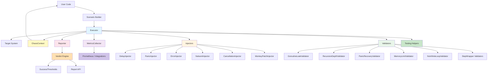
```mermaid
graph TB
    User[User Code] --> Scenario[Scenario Builder]
    Scenario --> Executor[Executor]

    Executor --> Target[Target System]
    Executor --> ChaosContext[ChaosContext]
    Executor --> Injectors[Injectors]
    Executor --> Validators[Validators]
    Executor --> Metrics[MetricsCollector]
    Executor --> Reporter[Reporter]
    Executor --> Testing[Testing Helpers]

    ChaosContext --> User

    Reporter --> Verdict[Verdict Engine]
    Verdict --> Thresholds[SuccessThresholds]
    Verdict --> Reports[Report API]

    Metrics --> Exporters[Prometheus / Integrations]

    Injectors --> Delay[DelayInjector]
    Injectors --> Panic[PanicInjector]
    Injectors --> Error[ErrorInjector]
    Injectors --> Network[NetworkInjector]
    Injectors --> Cancellation[CancellationInjector]
    Injectors --> MonkeyPatch[MonkeyPatchInjector]

    Validators --> Goroutine[GoroutineLeakValidator]
    Validators --> Recursion[RecursionDepthValidator]
    Validators --> PanicRecovery[PanicRecoveryValidator]
    Validators --> Memory[MemoryLimitValidator]
    Validators --> InfiniteLoop[NoInfiniteLoopValidator]
    Validators --> StepWrappers[StepWrapper Validators]

    style Executor fill:#e1f5ff
    style ChaosContext fill:#fff9c4
    style Injectors fill:#fff4e1
    style Validators fill:#e8f5e9
    style Metrics fill:#f3e5f5
    style Reporter fill:#fce4ec
    style Verdict fill:#ffe0b2
    style Exporters fill:#d1c4e9
    style Testing fill:#c8e6c9
```

## Component Interaction

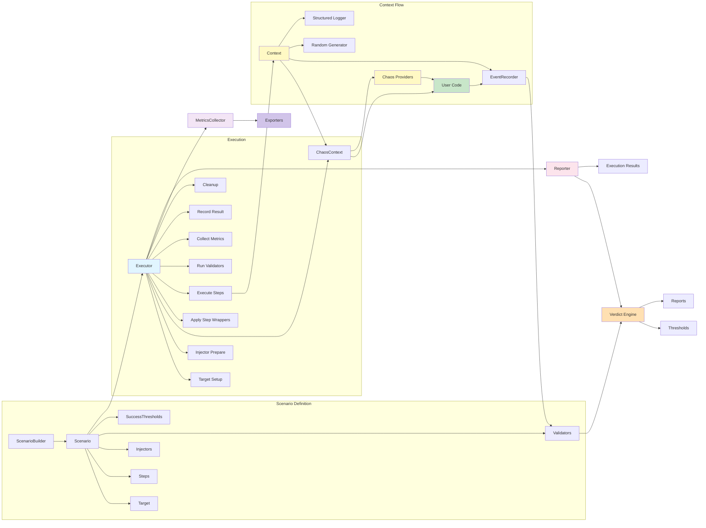
```mermaid
graph LR
    subgraph "Scenario Definition"
        SB[ScenarioBuilder] --> S[Scenario]
        S --> T[Target]
        S --> ST[Steps]
        S --> I[Injectors]
        S --> V[Validators]
        S --> TH[SuccessThresholds]
    end
    
    subgraph "Execution"
        E[Executor] --> TC[Target Setup]
        E --> IS[Injector Prepare]
        E --> CC[Build ChaosContext]
        E --> WR[Apply Step Wrappers]
        E --> EX[Execute Steps]
        E --> VA[Run Validators]
        E --> MT[Collect Metrics]
        E --> RP[Record Result]
        E --> CL[Cleanup]
    end
    
    subgraph "Context Flow"
        CTX[Context] --> CC[ChaosContext]
        CTX --> ER[EventRecorder]
        CTX --> RNG[Random Generator]
        CTX --> LOG[Structured Logger]
        CC --> UD[User Code]
        CC --> Providers[Chaos Providers]
        Providers --> UD
        ER --> V
    end
    
    S --> E
    E --> Metrics[MetricsCollector]
    E --> Reporter
    Metrics --> Exporters
    Reporter --> VerdictEngine[Verdict Engine]
    VerdictEngine --> Thresholds
    VerdictEngine --> Reports
    Reporter --> Results[Execution Results]
    EX --> CTX
    UD --> ER
    V --> VerdictEngine
    
    style E fill:#e1f5ff
    style CTX fill:#fff9c4
    style Providers fill:#fff9c4
    style UD fill:#c8e6c9
    style Metrics fill:#f3e5f5
    style Reporter fill:#fce4ec
    style VerdictEngine fill:#ffe0b2
    style Exporters fill:#d1c4e9
```

## Execution Flow

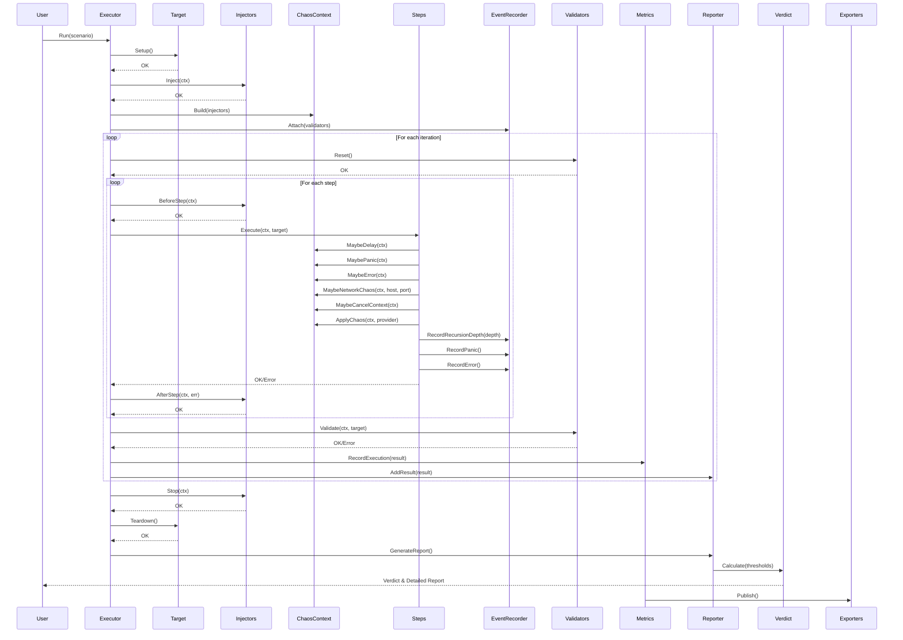
```mermaid
sequenceDiagram
    participant User
    participant Executor
    participant Target
    participant Injectors
    participant ChaosContext
    participant Steps
    participant EventRecorder
    participant Validators
    participant Metrics
    participant Reporter
    participant Verdict
    participant Exporters
    
    User->>Executor: Run(scenario)
    Executor->>Target: Setup()
    Target-->>Executor: OK
    
    Executor->>Injectors: Inject(ctx)
    Injectors-->>Executor: OK
    Executor->>ChaosContext: Build(injectors)
    Executor->>EventRecorder: Attach(validators)
    
    loop For each iteration
        Executor->>Validators: Reset()
        Validators-->>Executor: OK
        
        loop For each step
            Executor->>Injectors: BeforeStep(ctx)
            Injectors-->>Executor: OK
            
            Executor->>Steps: Execute(ctx, target)
            Steps->>ChaosContext: MaybeDelay(ctx)
            Steps->>ChaosContext: MaybePanic(ctx)
            Steps->>ChaosContext: MaybeError(ctx)
            Steps->>ChaosContext: MaybeNetworkChaos(ctx, host, port)
            Steps->>ChaosContext: MaybeCancelContext(ctx)
            Steps->>ChaosContext: ApplyChaos(ctx, provider)
            Steps->>EventRecorder: RecordRecursionDepth(depth)
            Steps->>EventRecorder: RecordPanic()
            Steps->>EventRecorder: RecordError()
            Steps-->>Executor: OK/Error
            
            Executor->>Injectors: AfterStep(ctx, err)
            Injectors-->>Executor: OK
        end
        
        Executor->>Validators: Validate(ctx, target)
        Validators-->>Executor: OK/Error
        
        Executor->>Metrics: RecordExecution(result)
        Executor->>Reporter: AddResult(result)
    end
    
    Executor->>Injectors: Stop(ctx)
    Injectors-->>Executor: OK
    
    Executor->>Target: Teardown()
    Target-->>Executor: OK
    
    Executor->>Reporter: GenerateReport()
    Reporter->>Verdict: Calculate(thresholds)
    Verdict-->>User: Verdict & Detailed Report
    Metrics->>Exporters: Publish()
```

## Injector Lifecycle

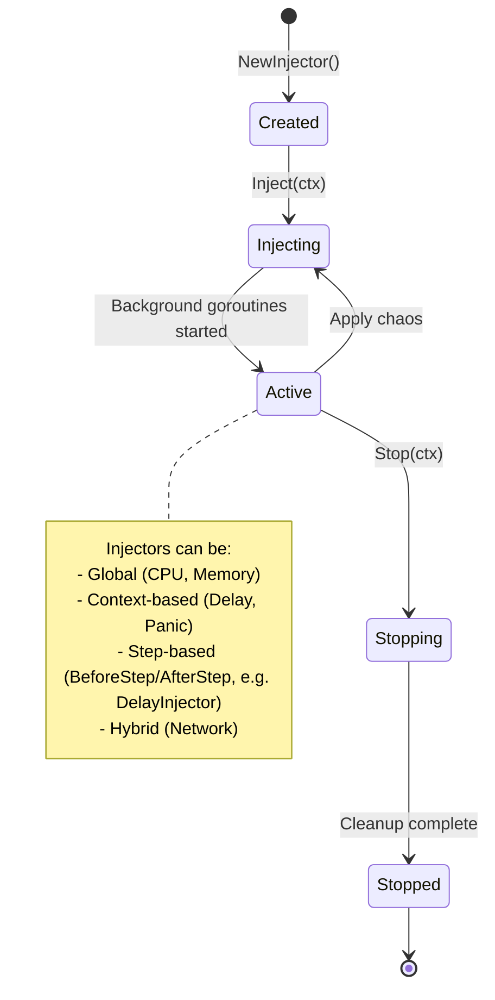
```mermaid
stateDiagram-v2
    [*] --> Created: NewInjector()
    Created --> Injecting: Inject(ctx)
    Injecting --> Active: Background goroutines started
    Active --> Injecting: Apply chaos
    Active --> Stopping: Stop(ctx)
    Stopping --> Stopped: Cleanup complete
    Stopped --> [*]
    
    note right of Active
        Injectors can be:
        - Global (CPU, Memory)
        - Context-based (Delay, Panic)
        - Step-based (BeforeStep/AfterStep, e.g. DelayInjector)
        - Hybrid (Network)
    end note
```

## Context-Based Chaos Flow

```mermaid
graph TD
    Start[User Code] --> Check{ChaosContext<br/>in Context?}
    Check -->|No| NoOp[No-op, continue]
    Check -->|Yes| GetCC[GetChaosContext]
    
    GetCC --> Delay{MaybeDelay?}
    Delay -->|Yes| DelayFunc[Call delayFunc]
    DelayFunc --> Sleep[time.Sleep]
    Sleep --> Continue[Continue]
    Delay -->|No| Continue
    
    GetCC --> Panic{MaybePanic?}
    Panic -->|Yes| PanicFunc[Call panicFunc]
    PanicFunc --> Trigger{Should Panic?}
    Trigger -->|Yes| Panic[panic]
    Trigger -->|No| Continue
    Panic -->|No| Continue
    
    GetCC --> Error{MaybeError?}
    Error -->|Yes| ErrorFunc[Call errorFunc]
    ErrorFunc --> ReturnError[Return injected error]
    ReturnError --> Continue
    Error -->|No| Continue
    
    GetCC --> Network{MaybeNetworkChaos?}
    Network -->|Yes| NetworkFunc[Call networkFunc]
    NetworkFunc --> Latency[Apply Latency]
    NetworkFunc --> Drop[Drop Connection]
    Latency --> Continue
    Drop --> Continue
    
    GetCC --> Cancel{MaybeCancelContext?}
    Cancel -->|Yes| CancelFunc[Create chaos child context]
    CancelFunc --> MaybeCancel{Random cancellation?}
    MaybeCancel -->|Yes| CancelChild[Cancel child context]
    MaybeCancel -->|No| Continue
    Cancel -->|No| Continue
    
    GetCC --> Apply{ApplyChaos(provider)?}
    Apply -->|Yes| Lookup[Find registered provider]
    Lookup -->|Found| ProviderApply[provider.Apply(ctx)]
    ProviderApply --> Continue
    Lookup -->|Missing| Continue
    Apply -->|No| Continue
    
    Continue --> End[End]
    NoOp --> End
```

## Validator Execution Flow

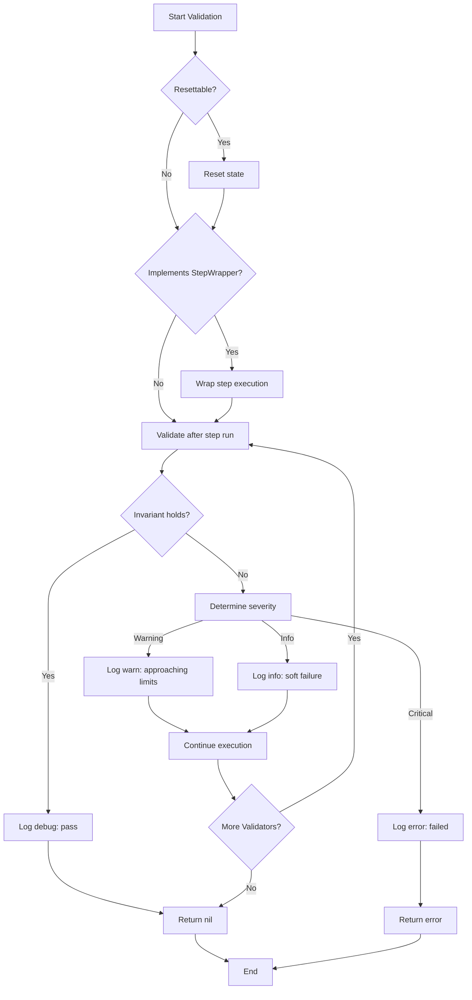
```mermaid
flowchart TD
    Start[Start Validation] --> Reset{Resettable?}
    Reset -->|Yes| ResetState[Reset state]
    Reset -->|No| WrapCheck
    ResetState --> WrapCheck
    
    WrapCheck{Implements StepWrapper?} -->|Yes| WrapStep[Wrap step execution]
    WrapCheck -->|No| Validate
    WrapStep --> Validate[Validate after step run]
    
    Validate --> Check{Invariant holds?}
    Check -->|Yes| LogPass[Log debug: pass]
    Check -->|No| DetermineSeverity[Determine severity]
    
    LogPass --> ReturnOK[Return nil]
    DetermineSeverity -->|Warning| LogWarn[Log warn: approaching limits]
    DetermineSeverity -->|Critical| LogError[Log error: failed]
    DetermineSeverity -->|Info| LogInfo[Log info: soft failure]
    
    LogWarn --> Continue[Continue execution]
    LogInfo --> Continue
    LogError --> ReturnError[Return error]
    
    Continue --> Next{More Validators?}
    Next -->|Yes| Validate
    Next -->|No| ReturnOK
    
    ReturnOK --> End[End]
    ReturnError --> End
```

## Injector Types

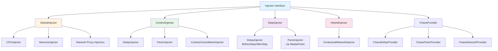
```mermaid
graph TB
    Injector[Injector Interface] --> Global[GlobalInjector]
    Injector --> Context[ContextInjector]
    Injector --> Step[StepInjector]
    Injector --> Hybrid[HybridInjector]
    
    Global --> CPU[CPUInjector]
    Global --> Memory[MemoryInjector]
    Global --> NetworkProxy[Network Proxy Injectors]
    
    Context --> Delay[DelayInjector]
    Context --> Panic[PanicInjector]
    Context --> Cancellation[ContextCancellationInjector]
    
    Step --> StepDelay[DelayInjector<br/>BeforeStep/AfterStep]
    Step --> ContextPanic[PanicInjector<br/>via MaybePanic]
    
    Hybrid --> NetworkContextual[ContextualNetworkInjector]
    
    Injector --> Provider[ChaosProvider]
    Provider --> DelayProvider[ChaosDelayProvider]
    Provider --> PanicProvider[ChaosPanicProvider]
    Provider --> NetworkProvider[ChaosNetworkProvider]
    
    style Injector fill:#e1f5ff
    style Global fill:#fff4e1
    style Context fill:#e8f5e9
    style Step fill:#f3e5f5
    style Hybrid fill:#fce4ec
```

## Validator Types

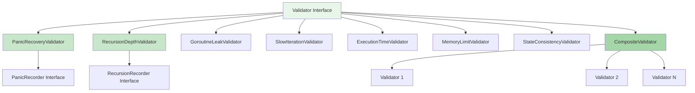
```mermaid
graph TB
    Validator[Validator Interface] --> PanicRecovery[PanicRecoveryValidator]
    Validator --> Recursion[RecursionDepthValidator]
    Validator --> Goroutine[GoroutineLeakValidator]
    Validator --> SlowIteration[SlowIterationValidator]
    Validator --> ExecutionTime[ExecutionTimeValidator]
    Validator --> Memory[MemoryLimitValidator]
    Validator --> StateConsistency[StateConsistencyValidator]
    Validator --> Composite[CompositeValidator]
    
    PanicRecovery --> PanicRecorder[PanicRecorder Interface]
    Recursion --> RecursionRecorder[RecursionRecorder Interface]
    
    Composite --> V1[Validator 1]
    Composite --> V2[Validator 2]
    Composite --> VN[Validator N]
    
    style Validator fill:#e8f5e9
    style PanicRecovery fill:#c8e6c9
    style Recursion fill:#c8e6c9
    style Composite fill:#a5d6a7
```

## Chaos Context and Providers

- `ChaosContext` is attached to the execution context by the executor and aggregates capabilities from active injectors.
- User code accesses chaos via helpers: `MaybeDelay`, `MaybePanic`, `MaybeError`, `MaybeNetworkChaos`, `MaybeCancelContext`, and `ApplyChaos`.
- Injectors implement capability interfaces (`ChaosDelayProvider`, `ChaosErrorProvider`, `ChaosPanicProvider`, `ChaosNetworkProvider`, `ChaosContextCancellationProvider`) to feed the chaos context.
- Generic providers implement `ChaosProvider` and can be triggered on demand with `ApplyChaos(ctx, providerName)`.
- Event recording helpers (`RecordPanic`, `RecordRecursionDepth`, `RecordError`) feed validator-aware instrumentation through the shared context.

## Verdict Engine and Success Thresholds

- The `Reporter` collects execution results and generates human-readable and JSON reports.
- `SuccessThresholds` define quality gates: minimum success rate, critical and warning validators, allowed failures, and average duration limits.
- `ValidationSeverity` classifies validator outcomes into critical, warning, or informational buckets for CI/CD pipelines.
- The verdict engine (`Reporter.GetVerdict`) evaluates executions against thresholds and returns a `Report` plus `Verdict` (`PASS`, `UNSTABLE`, `FAIL`) together with exit codes suitable for automation.
- Detailed analysis aggregates failures per validator, error type, and top error patterns to highlight recurring issues.

## Metrics and Exporters

- `MetricsCollector` tracks aggregate execution statistics and injector metrics during runtime.
- Prometheus integration (`exporters.PrometheusExporter`) exposes execution metrics, validator health, and injector state as scrapeable gauges, counters, and histograms.
- The HTTP adapter (`exporters.PrometheusExporter.Handler`) provides a ready-to-use `/metrics` endpoint for embedding into existing services.
- Metrics are recorded automatically by the executor; injectors can contribute additional counters by implementing `MetricsProvider`.

## Testing Integration

- The `chaoskit/testing` package provides `RunChaos` and `RunChaosSimple` helpers that integrate with `testing.T`.
- Options (`WithRepeat`, `WithFailurePolicy`, `WithExecutorOptions`, `WithDefaultThresholds`, `WithStrictThresholds`, `WithRelaxedThresholds`, `WithoutReport`, `WithoutVerdict`) allow tailoring execution for unit, integration, or soak tests.
- Verdict-aware runs emit structured reports on failure and fail the enclosing test when thresholds are violated.
- Reports can be printed to stdout/stderr or exported for further processing in CI environments.

## Extension Points

### Creating Custom Injectors

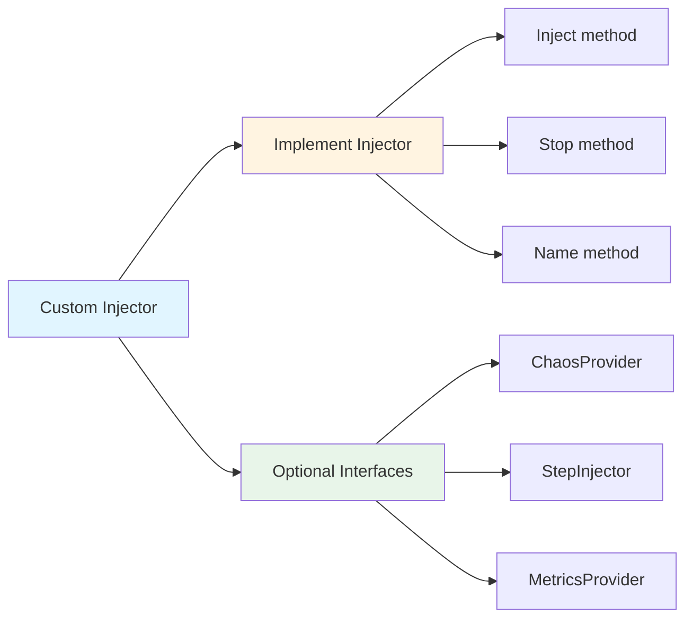
```mermaid
graph LR
    Custom[Custom Injector] --> Interface[Implement Injector]
    Interface --> Inject[Inject method]
    Interface --> Stop[Stop method]
    Interface --> Name[Name method]
    
    Custom --> Optional[Optional Interfaces]
    Optional --> Provider[ChaosProvider]
    Optional --> StepInjector[StepInjector]
    Optional --> MetricsProvider[MetricsProvider]
    
    style Custom fill:#e1f5ff
    style Interface fill:#fff4e1
    style Optional fill:#e8f5e9
```

### Creating Custom Validators

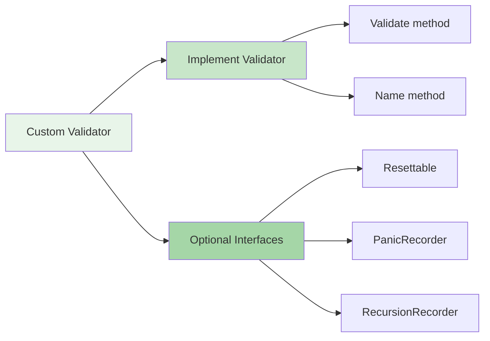
```mermaid
graph LR
    Custom[Custom Validator] --> Interface[Implement Validator]
    Interface --> Validate[Validate method]
    Interface --> Name[Name method]
    
    Custom --> Optional[Optional Interfaces]
    Optional --> Resettable[Resettable]
    Optional --> PanicRecorder[PanicRecorder]
    Optional --> RecursionRecorder[RecursionRecorder]
    
    style Custom fill:#e8f5e9
    style Interface fill:#c8e6c9
    style Optional fill:#a5d6a7
```

### Registering Chaos Providers

```mermaid
graph LR
    Provider[Custom ChaosProvider] --> Implement[Implement ChaosProvider]
    Implement --> Apply[Apply(ctx) bool]
    Provider --> Register[Register with ChaosContext]
    Register --> Use[Invoke via ApplyChaos(ctx, name)]

    style Provider fill:#fff9c4
    style Implement fill:#fff4e1
    style Register fill:#e1f5ff
```

## Data Flow

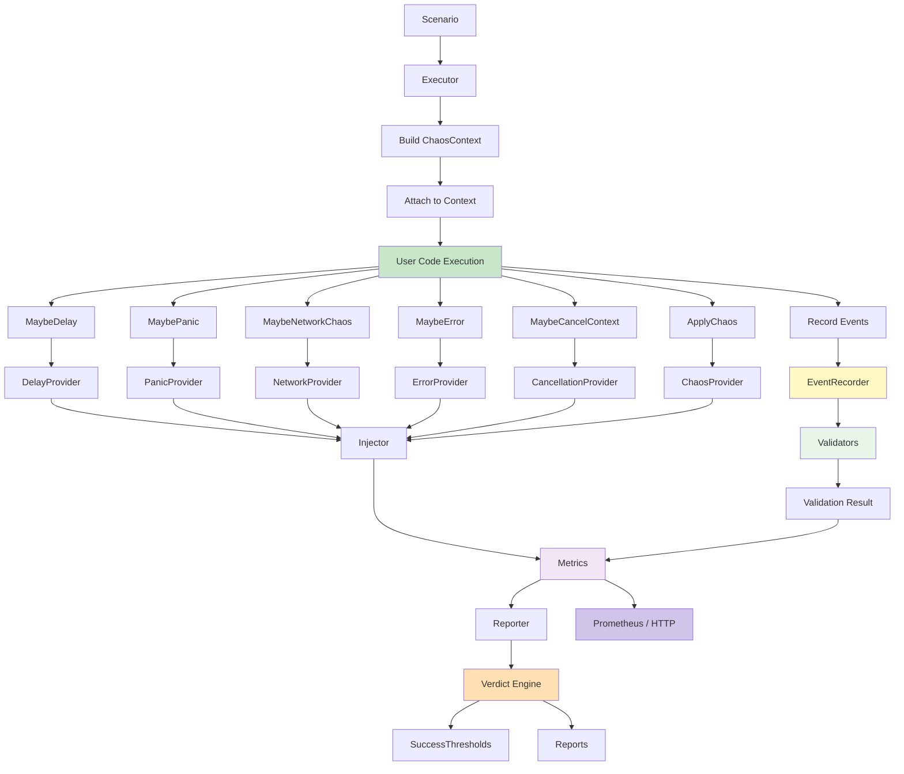
```mermaid
graph TB
    Scenario[Scenario] --> Executor[Executor]
    Executor --> BuildContext[Build ChaosContext]
    BuildContext --> AttachContext[Attach to Context]
    
    AttachContext --> UserCode[User Code Execution]
    UserCode --> MaybeDelay[MaybeDelay]
    UserCode --> MaybePanic[MaybePanic]
    UserCode --> MaybeNetworkChaos[MaybeNetworkChaos]
    UserCode --> MaybeError[MaybeError]
    UserCode --> MaybeCancel[MaybeCancelContext]
    UserCode --> ApplyChaos[ApplyChaos]
    UserCode --> RecordEvents[Record Events]
    
    MaybeDelay --> DelayProvider[DelayProvider]
    MaybePanic --> PanicProvider[PanicProvider]
    MaybeNetworkChaos --> NetworkProvider[NetworkProvider]
    MaybeError --> ErrorProvider[ErrorProvider]
    MaybeCancel --> CancellationProvider[CancellationProvider]
    ApplyChaos --> RegisteredProvider[ChaosProvider]
    RecordEvents --> EventRecorder[EventRecorder]
    
    EventRecorder --> Validators[Validators]
    DelayProvider --> Injector[Injector]
    PanicProvider --> Injector
    NetworkProvider --> Injector
    ErrorProvider --> Injector
    CancellationProvider --> Injector
    RegisteredProvider --> Injector
    
    Validators --> Result[Validation Result]
    Injector --> Metrics[Metrics]
    Result --> Metrics
    Metrics --> Reporter[Reporter]
    Reporter --> VerdictEngine[Verdict Engine]
    VerdictEngine --> Thresholds[SuccessThresholds]
    VerdictEngine --> Reports
    Metrics --> Exporters[Prometheus / HTTP]
    
    style UserCode fill:#c8e6c9
    style EventRecorder fill:#fff9c4
    style Validators fill:#e8f5e9
    style Metrics fill:#f3e5f5
    style VerdictEngine fill:#ffe0b2
    style Exporters fill:#d1c4e9
```

## Thread Safety Model

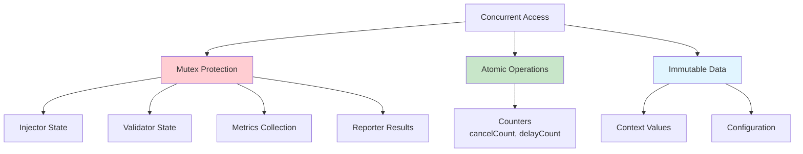
```mermaid
graph TB
    Concurrent[Concurrent Access] --> Mutex[Mutex Protection]
    Concurrent --> Atomic[Atomic Operations]
    Concurrent --> Immutable[Immutable Data]
    
    Mutex --> Injectors[Injector State]
    Mutex --> Validators[Validator State]
    Mutex --> Metrics[Metrics Collection]
    Mutex --> Reporter[Reporter Results]
    
    Atomic --> Counters[Counters<br/>cancelCount, delayCount]
    
    Immutable --> Context[Context Values]
    Immutable --> Config[Configuration]
    
    style Mutex fill:#ffcdd2
    style Atomic fill:#c8e6c9
    style Immutable fill:#e1f5ff
```

## Design Decisions

### 1. Context-Based Chaos Injection

**Decision**: Use context to propagate chaos capabilities to user code.

**Rationale**:
- Non-intrusive: No need to pass injectors explicitly
- Thread-safe: Context is immutable and goroutine-safe
- Flexible: Can be attached/detached dynamically
- Standard: Follows Go idioms

**Trade-offs**:
- Requires code instrumentation (calling MaybeDelay, etc.)
- Context overhead (minimal)

### 2. Structured Logging with slog

**Decision**: Use Go's standard `log/slog` package for all logging.

**Rationale**:
- Standard library: No external dependencies
- Structured: Easy to parse and filter
- Performance: Optimized for production use
- Levels: Built-in support for Debug/Info/Warn/Error

**Trade-offs**:
- Requires Go 1.25+ (acceptable for modern projects)

### 3. Interface-Based Design

**Decision**: Use interfaces extensively for extensibility.

**Rationale**:
- Testability: Easy to mock and test
- Flexibility: Multiple implementations
- Extensibility: Users can create custom components
- Clean: Clear contracts between components

**Trade-offs**:
- More interfaces to maintain
- Potential over-engineering (mitigated by keeping interfaces focused)

### 4. Builder Pattern for Scenarios

**Decision**: Use fluent builder pattern for scenario construction.

**Rationale**:
- Readability: Clear, chainable API
- Type safety: Compile-time validation
- Flexibility: Optional parameters without function overloading
- Discoverability: IDE autocomplete guides usage

**Trade-offs**:
- More code to maintain
- Slightly more complex than struct initialization

### 5. Separation of Injectors and Validators

**Decision**: Keep injectors and validators as separate components.

**Rationale**:
- Single Responsibility: Each component has one job
- Composability: Mix and match independently
- Testability: Test injection and validation separately
- Clarity: Clear separation of concerns

**Trade-offs**:
- More components to manage
- Potential duplication (mitigated by shared interfaces)

### 6. Severity-Aware Validation and Verdicts

**Decision**: Classify validator failures by severity and evaluate scenarios against configurable thresholds.

**Rationale**:
- CI/CD-friendly: Enables pass/unstable/fail outcomes with exit codes
- Transparency: Detailed reports highlight offending validators and trends
- Flexibility: Teams can adjust thresholds per environment (strict vs relaxed)
- Automation: Supports gating deployments on resilience metrics

**Trade-offs**:
- Requires threshold configuration
- More complex reporter implementation

### 7. Built-in Metrics and Exporters

**Decision**: Capture runtime metrics and expose them via Prometheus exporter.

**Rationale**:
- Observability: Surface execution, validator, and injector health externally
- Integration: Compatible with existing monitoring stacks
- Diagnostics: Simplifies long-running experiment analysis

**Trade-offs**:
- Additional dependency on monitoring infrastructure for full value
- Slight overhead from metrics bookkeeping

## Performance Considerations

1. **Lock Granularity**: Fine-grained locks to minimize contention
2. **Atomic Operations**: Used for counters to avoid mutex overhead
3. **Context Immutability**: Context values are immutable, safe for concurrent access
4. **Copy-on-Read**: Maps and slices are copied when needed for thread safety
5. **Lazy Initialization**: Validators initialize baselines on first use

## Security Considerations

1. **Monkey Patching**: Only for testing, requires explicit build flags
2. **Network Proxies**: Requires explicit setup, not enabled by default
3. **Context Isolation**: Each scenario has isolated context
4. **Resource Limits**: Validators enforce resource limits

---

**Last Updated**: November 2025  
**Version**: 1.1

